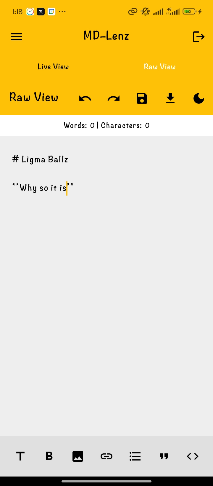
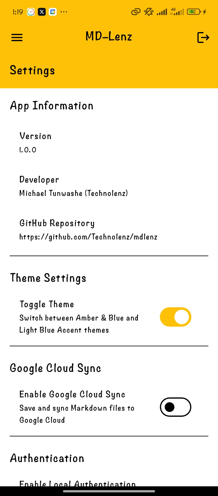
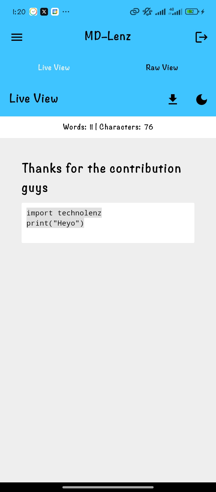
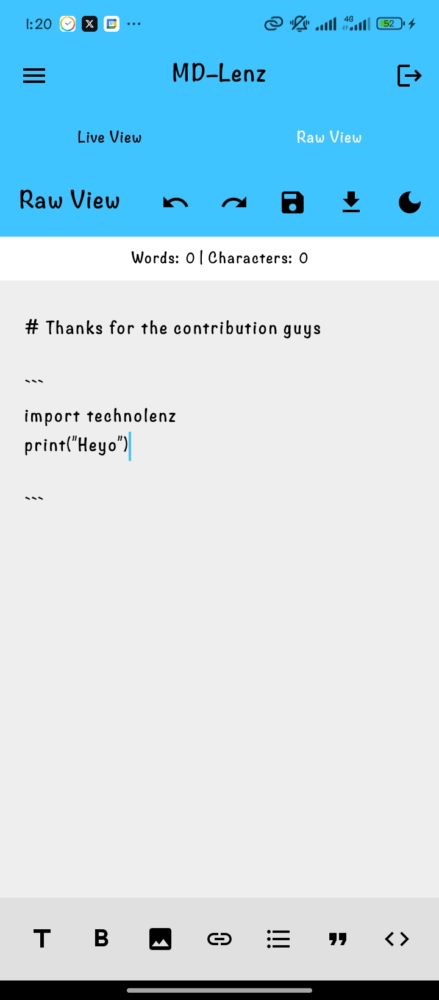
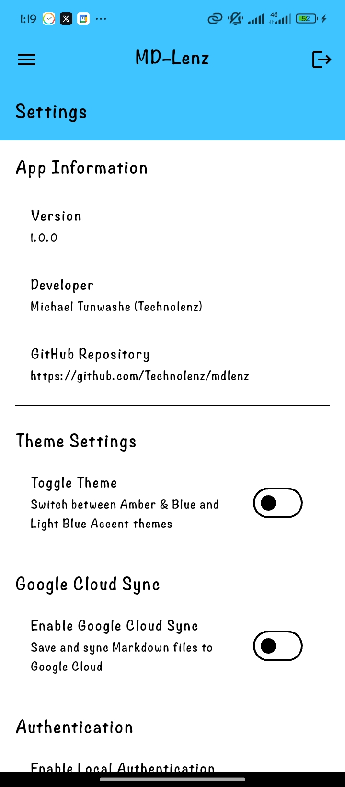
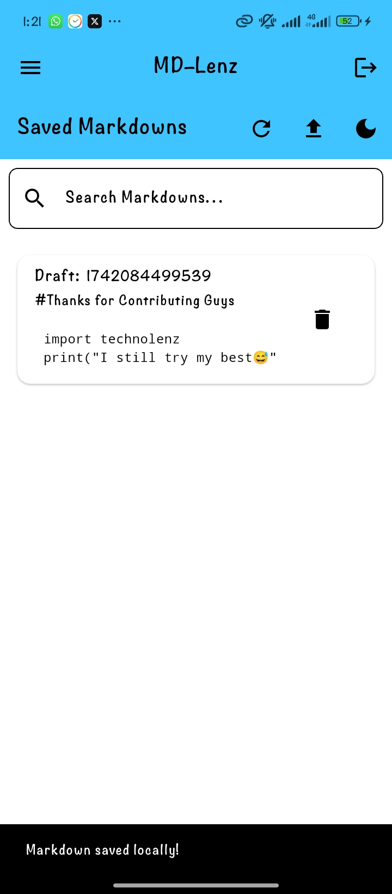

# MDLenz - Markdown Editor & Viewer

MDLenz is a powerful and intuitive **Markdown editor and viewer** designed for seamless note-taking, document editing, and file management. With features like **local authentication**, and **biometric security**, MDLenz ensures your documents are always secure and accessible.

---

## Features

- **Markdown Editing**: Write and preview Markdown documents in real-time.
- **Local Authentication**: Secure your app with PIN or biometric authentication.
- **File Management**: Organize and manage your Markdown files with ease.
- **Custom Themes**: Switch between light and dark themes for a personalized experience.
- **Offline Support**: Work on your documents even without an internet connection.

---

## Screenshots

 |  | 
:-------------------------:|:-------------------------:|:-------------------------:
**Home Screen**             | **Editor Screen**          | **Settings Screen**

 |  | 
:-------------------------:|:-------------------------:|:-------------------------:
**Home Screen 2**          | **Editor Screen 2**       | **Settings Screen 2**


**File Manager**

---

## Getting Started

### Prerequisites

- **Flutter SDK**: Ensure you have Flutter installed. If not, follow the [official Flutter installation guide](https://flutter.dev/docs/get-started/install).

### Installation

1. **Clone the Repository**:
   ```bash
   git clone https://github.com/technolenz/mdlenz.git
   cd mdlenz
   ```

2. **Install Dependencies**:
   ```bash
   flutter pub get
   ```

3. **Run the App**:
   ```bash
   flutter run
   ```

---

## Usage

1. **Authentication**:
   - Set up a PIN or enable biometric authentication in the **Settings**.
   - Use the PIN or biometrics to unlock the app.

2. **Editing Markdown**:
   - Create a new Markdown file or open an existing one.
   - Use the editor to write and preview your Markdown content in real-time.

3. **Customizing Themes**:
   - Switch between light and dark themes in the **Settings**.

---

## Folder Structure

```
mdlenz/
├── android/               # Android-specific files
├── ios/                   # iOS-specific files
├── lib/                   # Main application code
│   ├── main.dart          # Entry point
│   ├── views/             # UI screens
│   ├── widgets/           # Reusable widgets
│   ├── providers/         # State management
│   ├── functions/         # Helper functions
│   └── models/            # Data models
├── assets/                # Static assets (images, fonts, etc.)
├── test/                  # Unit and widget tests
└── pubspec.yaml           # Dependencies and project configuration
```

---

## Dependencies

- **Flutter**: UI framework for building natively compiled applications.
- **Local Authentication**: For PIN and biometric security.
- **Markdown Package**: For rendering Markdown content.
- **Provider**: For State management
- **Page Transitions**: For nice page transitions

---

## Contributing

Contributions are welcome! If you'd like to contribute, please follow these steps:

1. Fork the repository.
2. Create a new branch
3. Commit your changes
4. Push to the branch
5. Open a pull request.

---

## License

This project is licensed under the **GNU License**. See the [LICENSE](LICENSE) file for details.

---

## Acknowledgments

- **Flutter Team**: For building an amazing framework.
- **Flutter Viz devs**: Tried out their beta demo, very nice

---

## Contact

For questions, feedback, or support, feel free to reach out:

- **Email**: technolenz@gmail.com
- **GitHub**: [Technolenz](https://github.com/technolenz)
- **Twitter**: [@Miclenzy](https://x.com/miclenzy)

---

Enjoy using **MDLenz**! 🚀

